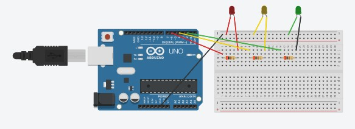

# Arduino Traffic Light

## Description

This project is a simulation of a traffic light using an Arduino UNO

## Components

- Arduino Uno
- Breadboard
- Jumper Wires
- 3 * LED
- USB Cable
- 3 x 220Ω resistor

## Wiring

- GND -> Green LED Cathode, Red LED Cathode, Yellow LED Cathode
- Arduino digital pin 2 -> 220Ω resistor -> Green LED Anode
- Arduino digital pin 4 -> 220Ω resistor -> Yellow LED Anode
- Arduino digital pin 6 -> 220Ω resistor -> Red LED Anode

## Diagram

## Skills learned

- Basic circuit design
- LED control
- Sequential programming

## Author

Nastoula Maria